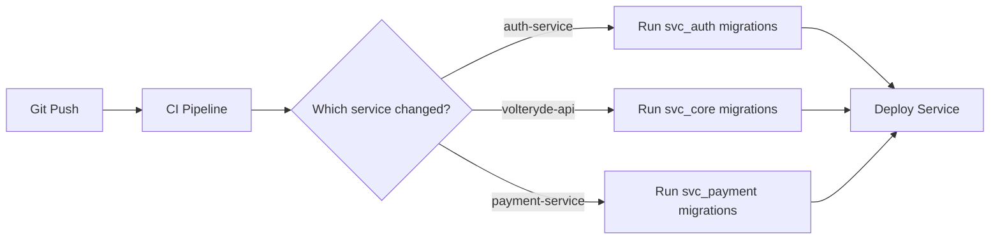

# Supabase PostgreSQL Migration Strategy for Volteryde

## Executive Summary

Migrate **10 local PostgreSQL databases** powering Volteryde's microservices to a **single Supabase project** using a **schema-per-service isolation pattern**. This maintains logical separation while avoiding the cost and operational overhead of 10 separate Supabase projects.

---

## 1. Current Architecture Audit

| # | Service | Framework | Current Database | Domain |
|---|---------|-----------|-----------------|--------|
| 1 | `auth-service` | Spring Boot | `auth_db` | Identity |
| 2 | `client-auth-service` | Spring Boot | `client_auth_db` | Identity |
| 3 | `user-management-service` | Spring Boot | `user_db` | Identity |
| 4 | `payment-service` | Spring Boot | `payment_db` | Payments |
| 5 | `fleet-management-api` | NestJS | `fleet_db` | Fleet Ops |
| 6 | `charging-infrastructure-api` | NestJS | `charging_db` | Fleet Ops |
| 7 | `booking-api` | NestJS | `booking_db` | Bookings |
| 8 | `telematics-api` | NestJS | `telematics_db` | Telemetry |
| 9 | `volteryde-api` | NestJS | `volteryde` | Core (GTFS, Locator) |
| 10 | `temporal` | Temporal | `temporal` + `temporal_visibility` | Workflows |

---

## 2. Architectural Decision: Schema-Per-Service (Single Project)

### Why NOT Separate Supabase Projects?

| Concern | Separate Projects | Single Project + Schemas |
|---------|-------------------|--------------------------|
| **Cost** | $0/mo × 10 = $0 (Free), but **Pro** = $25/mo × 10 = **$250/mo** | **$25/mo** total |
| **Connection pooling** | Separate PgBouncer per project | Shared, more efficient |
| **Cross-service queries** | Impossible without API | Possible via `dblink` if needed (escape hatch) |
| **Ops overhead** | 10 dashboards, 10 backups | 1 dashboard, 1 backup |
| **True isolation** | ✅ Full DB isolation | ⚠️ Schema-level (enforced by roles) |
| **Future separation** | Already separated | Easy to split later via `pg_dump` per schema |

### Decision: **Single Supabase Project + Schema-per-service + Role-per-service**

This is the industry-standard approach for microservices on managed PostgreSQL. Schemas provide **logical isolation** while roles enforce **access control boundaries**. Each service:
- Owns its own schema (e.g., `svc_auth`, `svc_payment`)
- Has a dedicated PostgreSQL role with access ONLY to its schema
- Cannot read/write other services' tables
- Communicates with other services exclusively via APIs or events

> [!IMPORTANT]
> **Temporal is excluded** from this migration. Temporal requires its own PostgreSQL database with specific schemas (`temporal` and `temporal_visibility`). It should remain self-hosted or use Temporal Cloud.

---

## 3. Schema & Role Naming Conventions

### Schemas
```
svc_auth          → auth-service tables
svc_client_auth   → client-auth-service tables
svc_users         → user-management-service tables
svc_payment       → payment-service tables
svc_fleet         → fleet-management-api tables
svc_charging      → charging-infrastructure-api tables
svc_booking       → booking-api tables
svc_telematics    → telematics-api tables
svc_core          → volteryde-api tables (GTFS, locator, etc.)
shared_types      → shared ENUMs, composite types (read-only by all)
```

### Roles
```
role_auth          → Full access to svc_auth only
role_client_auth   → Full access to svc_client_auth only
role_users         → Full access to svc_users only
role_payment       → Full access to svc_payment only
role_fleet         → Full access to svc_fleet only
role_charging      → Full access to svc_charging only
role_booking       → Full access to svc_booking only
role_telematics    → Full access to svc_telematics only
role_core          → Full access to svc_core only
role_readonly      → SELECT-only across all schemas (for analytics/monitoring)
```

---

## 4. Step-by-Step Setup

### Phase 1: Create Supabase Project
- Create project **"volteryde"** in organization **"Kaeytee's Org"** (`phmflvmpzagucmkytzab`)
- Region: **eu-west-1** (closest to West Africa for lowest latency)
- Cost: **$0/month** (Free tier)

### Phase 2: Create Schemas & Roles (via SQL Migration)
```sql
-- Migration: 001_create_schemas_and_roles

-- Create service schemas
CREATE SCHEMA IF NOT EXISTS svc_auth;
CREATE SCHEMA IF NOT EXISTS svc_client_auth;
CREATE SCHEMA IF NOT EXISTS svc_users;
CREATE SCHEMA IF NOT EXISTS svc_payment;
CREATE SCHEMA IF NOT EXISTS svc_fleet;
CREATE SCHEMA IF NOT EXISTS svc_charging;
CREATE SCHEMA IF NOT EXISTS svc_booking;
CREATE SCHEMA IF NOT EXISTS svc_telematics;
CREATE SCHEMA IF NOT EXISTS svc_core;
CREATE SCHEMA IF NOT EXISTS shared_types;

-- Enable PostGIS (needed for GTFS geospatial data)
CREATE EXTENSION IF NOT EXISTS postgis SCHEMA extensions;

-- Create service roles with LOGIN capability
CREATE ROLE role_auth LOGIN PASSWORD 'GENERATED_SECRET_1';
CREATE ROLE role_client_auth LOGIN PASSWORD 'GENERATED_SECRET_2';
CREATE ROLE role_users LOGIN PASSWORD 'GENERATED_SECRET_3';
CREATE ROLE role_payment LOGIN PASSWORD 'GENERATED_SECRET_4';
CREATE ROLE role_fleet LOGIN PASSWORD 'GENERATED_SECRET_5';
CREATE ROLE role_charging LOGIN PASSWORD 'GENERATED_SECRET_6';
CREATE ROLE role_booking LOGIN PASSWORD 'GENERATED_SECRET_7';
CREATE ROLE role_telematics LOGIN PASSWORD 'GENERATED_SECRET_8';
CREATE ROLE role_core LOGIN PASSWORD 'GENERATED_SECRET_9';
CREATE ROLE role_readonly LOGIN PASSWORD 'GENERATED_SECRET_10';
```

### Phase 3: Enforce Access Control
```sql
-- Migration: 002_enforce_access_control

-- Revoke default public schema access
REVOKE ALL ON SCHEMA public FROM PUBLIC;

-- Grant each role access ONLY to its schema
-- (repeat pattern for each service)
GRANT USAGE, CREATE ON SCHEMA svc_auth TO role_auth;
GRANT ALL ON ALL TABLES IN SCHEMA svc_auth TO role_auth;
GRANT ALL ON ALL SEQUENCES IN SCHEMA svc_auth TO role_auth;
ALTER DEFAULT PRIVILEGES IN SCHEMA svc_auth
  GRANT ALL ON TABLES TO role_auth;
ALTER DEFAULT PRIVILEGES IN SCHEMA svc_auth
  GRANT ALL ON SEQUENCES TO role_auth;

-- Set search_path so each role defaults to its schema
ALTER ROLE role_auth SET search_path TO svc_auth, shared_types;
ALTER ROLE role_client_auth SET search_path TO svc_client_auth, shared_types;
ALTER ROLE role_users SET search_path TO svc_users, shared_types;
ALTER ROLE role_payment SET search_path TO svc_payment, shared_types;
ALTER ROLE role_fleet SET search_path TO svc_fleet, shared_types;
ALTER ROLE role_charging SET search_path TO svc_charging, shared_types;
ALTER ROLE role_booking SET search_path TO svc_booking, shared_types;
ALTER ROLE role_telematics SET search_path TO svc_telematics, shared_types;
ALTER ROLE role_core SET search_path TO svc_core, shared_types, extensions;

-- Read-only role for analytics
GRANT USAGE ON SCHEMA svc_auth, svc_client_auth, svc_users,
  svc_payment, svc_fleet, svc_charging, svc_booking,
  svc_telematics, svc_core TO role_readonly;
-- (GRANT SELECT on all tables to role_readonly)
```

### Phase 4: Data Migration (Per Service)

For each service, run this pattern locally:

```bash
# 1. Export from local PostgreSQL (schema + data)
pg_dump -h localhost -U postgres -d auth_db \
  --no-owner --no-privileges --data-only \
  -f auth_db_data.sql

# 2. Import to Supabase (into the correct schema)
# First, create tables in svc_auth schema using your ORM migrations
# Then load data:
psql "postgresql://postgres:[PASSWORD]@[SUPABASE_HOST]:5432/postgres" \
  -c "SET search_path TO svc_auth;" \
  -f auth_db_data.sql
```

**Migration Order** (respecting dependencies):
1. `svc_auth` + `svc_client_auth` (no deps)
2. `svc_users` (may reference auth)
3. `svc_core` (GTFS data — large, run separately)
4. `svc_payment`, `svc_fleet`, `svc_charging`
5. `svc_booking` (depends on GTFS)
6. `svc_telematics`

### Phase 5: Update Service Configurations

Each service needs its `DATABASE_URL` updated. The pattern:

```
postgresql://role_<service>:<password>@<supabase-host>:6543/postgres?schema=svc_<service>
```

> [!WARNING]
> Use port **6543** (Supavisor connection pooler), NOT **5432** (direct). This is critical for connection management at scale.

#### Environment Variables ([.env](file:///Users/kaeytee/Desktop/CODES/Volteryde/Codebase/System/Client-App/.env) / Docker)

```env
# === Supabase Connection Config ===
SUPABASE_HOST=db.xxxxxxxxxxxx.supabase.co
SUPABASE_PORT=6543
SUPABASE_DB=postgres

# === Per-Service Credentials ===
# auth-service (Spring Boot)
SPRING_DATASOURCE_URL=jdbc:postgresql://${SUPABASE_HOST}:${SUPABASE_PORT}/${SUPABASE_DB}?currentSchema=svc_auth
SPRING_DATASOURCE_USERNAME=role_auth
SPRING_DATASOURCE_PASSWORD=<secret>

# volteryde-api (NestJS)
DATABASE_URL=postgresql://role_core:<secret>@${SUPABASE_HOST}:${SUPABASE_PORT}/${SUPABASE_DB}?schema=svc_core
DATABASE_HOST=${SUPABASE_HOST}
DATABASE_PORT=${SUPABASE_PORT}
DATABASE_USERNAME=role_core
DATABASE_PASSWORD=<secret>
DATABASE_NAME=${SUPABASE_DB}
DATABASE_SCHEMA=svc_core
```

---

## 5. Preventing Tight Coupling

### ✅ DO
- Each service owns its schema — full CRUD
- Services communicate via **REST APIs** or **event bus** (Redis Pub/Sub, MQTT)
- Use **shared_types** schema for common ENUMs only (e.g., `vehicle_status`, `payment_status`)
- Use **API contracts** (OpenAPI / Protobuf) between services

### ❌ DON'T
- Never grant cross-schema write access
- Never use foreign keys across schemas
- Never use `JOIN` across service schemas
- Never let Service A read Service B's tables directly

### How Supabase RLS Adds a Layer
Supabase's Row Level Security can enforce per-row access policies on top of schema-level isolation. For public-facing tables (e.g., GTFS stops), RLS policies can be added to ensure only authenticated users with the correct JWT claims can read data.

---

## 6. CI/CD Considerations



- Each service manages its own migrations in its own directory
- CI runs migrations against the **correct schema** using the service's role
- Use **Supabase CLI** or **direct `psql`** for migration execution
- Never run migrations as `postgres` superuser in CI — use the service role

---

## 7. Backup & Disaster Recovery

| Feature | Free Tier | Pro Tier ($25/mo) |
|---------|-----------|-------------------|
| Daily backups | ❌ | ✅ (7 days retention) |
| Point-in-time recovery | ❌ | ✅ (up to 7 days) |
| Manual `pg_dump` | ✅ | ✅ |

### Recommended Strategy
1. **Automated**: Upgrade to Pro for daily backups + PITR
2. **Manual**: Weekly `pg_dump` per schema to S3/GCS
3. **Schema-level restore**: `pg_dump -n svc_auth` allows restoring a single service without affecting others

---

## 8. Common Mistakes to Avoid

| Mistake | Why It's Bad | Prevention |
|---------|-------------|------------|
| All tables in `public` schema | Creates a monolith | Enforce schema-per-service |
| Single `postgres` superuser for all services | No access control | Create per-service roles |
| Cross-schema foreign keys | Tight coupling | Use IDs + API lookups instead |
| Not using connection pooler | Connection exhaustion | Always use port `6543` |
| Migrating Temporal to Supabase | Temporal needs its own DB with specific schemas | Keep Temporal self-hosted |
| Storing secrets in code | Security risk | Use env vars / secret manager |
| Running all migrations as superuser | Privilege escalation risk | Each service migrates with its own role |

---

## 9. User Review Required

> [!IMPORTANT]
> **Organization Selection**: I plan to create the project in **"Kaeytee's Org"** (`phmflvmpzagucmkytzab`). The cost is **$0/month** (Free tier). Please confirm this is the correct org.

> [!WARNING]
> **Region Selection**: I recommend **eu-west-1** (Ireland) for lowest latency to West Africa. If you'd prefer a different region, let me know.

> [!CAUTION]
> **Temporal Exclusion**: Temporal requires its own dedicated PostgreSQL database with specific internal schemas. It will NOT be migrated to Supabase and should remain self-hosted or use Temporal Cloud.

---

## 10. Execution Plan

1. ✅ Create Supabase project `volteryde` in `Kaeytee's Org` (eu-west-1)
2. Apply Migration 001: Create schemas and roles
3. Apply Migration 002: Enforce access control policies
4. Enable PostGIS extension for geospatial (GTFS)
5. Migrate each service's data using `pg_dump` / ORM migrations
6. Update [.env](file:///Users/kaeytee/Desktop/CODES/Volteryde/Codebase/System/Client-App/.env) files with Supabase connection strings
7. Test each service individually against Supabase
8. Run integration tests across the full stack
9. Switch production traffic
10. Decommission local PostgreSQL
